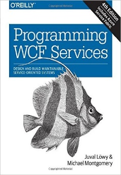

## Заметки о книгах для .Net-разработчика
Версия: **2016** год

Обложка | Название| Перевод | Комментарии
--- | --- | --- | --- 

#### Платформа: Начальный уровень
С этих книг можно начинать с нуля:

|||
--- | --- | --- | --- 
|*Andrew Troelsen*  C# 6.0 and the .NET 4.6 Framework (7th edition)|Вроде как есть перевод шестого издания. Про качество - не знаю (вроде раньше было ИД Питер - сейчас Диалектика)| Начало начал. Азбука.
|*Joseph Albahari, Ben Albahari* C# 6.0 in a Nutshell| Есть перевод актуального издания (нормальный)|Не путать с Pocket Reference /Карманный справочник

#### Платформа: Профессиональный уровень

Разобравшись с азами языка и платформы, можно начинать углубляться:

|||
--- | --- | --- | --- 
|*Jon Skeet* C# in Depth (3rd edition)|Есть перевод актуального издания (третье) (говорят норм)|Второе издание слишком старое и спорное
|*Mark Michaelis, Eric Lippert* Essential C# 6.0|Есть старый перевод "По существу о C# 4.0", без Липперта|Продвинутый вариант Троелсена 
|*Jeffrey Richter* CLR via C# (fourth edition)|Есть перевод актуального издания (нормальный) - розовая обложка|Ни в коем случае не третье издание (если про перевод)

#### Платформа: Экспертный уровень
За тонкими моментами, внутренностями и производительностью - это сюда:

|||
--- | --- | --- | --- 
|*Serge Lidin* .Net IL Assembler (2014)|Есть перевод 2002 года - слишком стар|Наиболее цельное описание внутренностей Ilasm
|*Ben Watson* Writing High-Performance .NET Code (2014)|Не переводилось|Разбор полетов с механизмами .Net, влияющими на перформанс
|*Mohammad Rahman* C# Deconstructed|Не переводилось|Разбор C# до уровня работы CLR и OS/железа
|*Mohammad Rahman* Expert C# 5.0 with .Net 4.5 Framework |Не переводилось|C# Deconstructed + щепотка CLR via C# на стероидах с описанием внутренностей платформы
|*Sasha Goldshtein et al* Pro .Net Performance|Вроде как есть перевод 2014 года: Оптимизация приложений на платформе .Net|Самая популярная книга по перформансу

#### Общие вещи:
Базовые вещи, не связанные напрямую со специфичными технологиями:

|||
--- | --- | --- | --- 
|*Сергей Тепляков* Паттерны проектирования на платформе .Net|Не требует перевода|**ЕДИНСТВЕННАЯ** нормальная книга по паттернам на .Net
|*Mark Seemann* Dependency Injection in .Net|Есть перевод "Внедрение зависимостей в .NET"|Материал неплохой, но автор местами - полный абсолютист и настоящий ситх, поэтому текст нужно читать с осторожностью, во избежание радикализации
|*Alex Davies* Async in C# 5.0|Есть перевод "Асинхронное программирование в C# 5.0"|Обзор async в TPL с разбором.. Но для C# 5.0 (то бишь некоторые косяки исправлены)

#### Технологии: WPF
Десктопная разработка, крутая кривая обучения:

|||
--- | --- | --- | --- 
|*Matthew McDonald* Pro WPF 4.5 in C#|Есть перевод: WPF: Windows Presentation Foundation в .NET 4.5 с примерами на C# 5.0 для профессионалов|WPF с 0
|*Chris Sells* Programming WPF 2nd edition|Не переводилось|Расширенный разбор

#### Технологии: WCF

Сетевые не-web сервисы

|||
--- | --- | --- | --- 
|*Juval Lowy* Programming WCF Services 4th edition|Не переводилось|Серьезный разбор стека, с косяками и сопроводительными библиотеками. Вводный курс можно из Троелсена взять

#### Технологии: ASP.NET

Веб-страницы и веб-сервисы:

|||
--- | --- | --- | --- 
|*Adam Freeman* Pro ASP.NET 4.5 in C#|Есть перевод|Ввод в ASP.NET (WebForms + IIS), до MVC 
|*Dino Esposito* Programming Microsoft ASP.NET MVC 3rd edition|Не переводилось|Переход к MVC. Именно Эспозито, именно третья редакция. От других авторов - совершенно иные книги
|*Jon Galloway et al* Professional ASP.NET MVC 5|Не переводилось|Именно Galloway, не Freeman