## Заметки о книгах для .Net-разработчика (2020)

Версия **2020** год. Исходная коллекция [здесь](README.md) 

#### Платформа: Экспертный уровень
Внутренности и производительность

Обложка | Название| Комментарии 
--- | --- | --- 
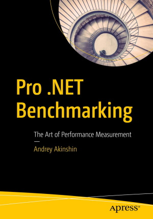| *Andrey Akinshin* Pro .Net Benchmarking | От автора BenchmarkDotNet, но вопреки названию, не только про бенчмаркинг, но и про природу оптимизаций, производительности и проблем измерения перформанса. И кучи вопросов, на которые правильный ответ - "Зависит". Условно говоря, первая половина Шипилёва для .NET
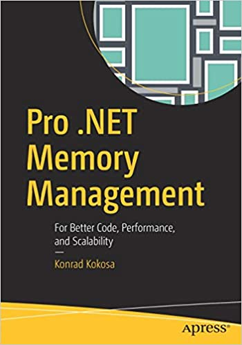| *Konrad Kokosa* Pro .Net Memory Management| Ультимативная книга по работе с памятью/сборке мусора в .NET. Почти что "библия рантайма" - но это скорее про BOTR. Вторая половина Шипилёва для .NET

#### Общие вещи и технологии

Обложка | Название| Комментарии 
--- | --- | --- 
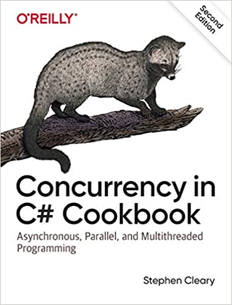|*Stephen Cleary* Concurrency in C# Cookbook (2nd edition) | Свежее издание, от одного из лучших авторов в .NET про асинхронное программирование. Вместе с книгой полезно смотреть его [блог](blog.stephencleary.com) и библиотеки @StephenCleary
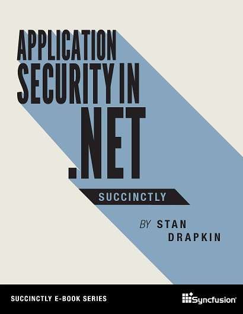|*Stan Drapkin* Application Security in .NET Succinctly | Книга доступна бесплатно от [Syncfusion](https://www.syncfusion.com/blogs/post/interview-with-application-security-in-net-succinctly-author-stan-drapkin.aspx), это вторая редакция. Первая редакция - SecurityDriven.NET ([сайт](https://securitydriven.net/)). Подробный обзор подводных камней связанных с прикладной криптографией в .NET. Такой вот companion guide к библиотеке прикладной криптографии SecurityDriven.Inferno (@sdrapkin)
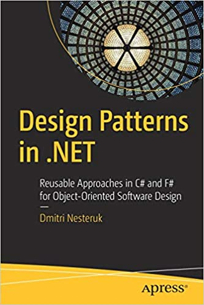| *Dmitri Nesteruk* Design Patterns in .Net | Не так хороша, как книга Теплякова, но посвежее и с более широким обзором. 
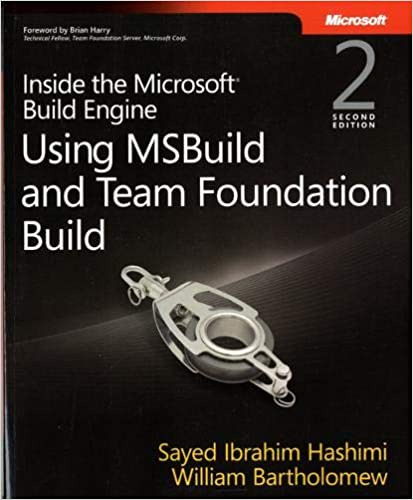|*Sayed Ibrahim Hashimi* Inside the Microsoft Build Engine (2nd endition)| 2011 год, свежайшая книга по MSBuild. Адекватный материал - в первой половине книги.

#### Не .NET

Обложка | Название| Комментарии 
--- | --- | ---
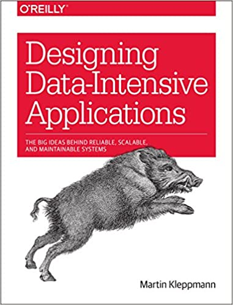|*Martin Kleppmann* Designing Data-Intensive Applications | Книга с феноменально взрывной популярностью. Великолепная выжимка опыта и знаний про устройство и поведение распределенных систем хранения данных. Фокус на "распределенных"
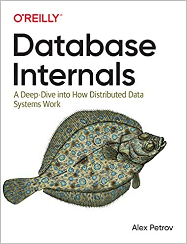| *Alex Petrov* Database Internals | Дополнение к Клепману, больший фокус на устройство баз данных
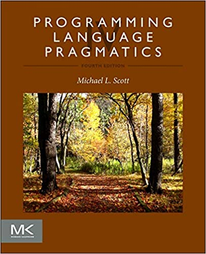| *Michael L Scott* Programming Language Pragmatics | Гигантская академическая книга про языки программирования: классификация, устроство, дизайн, парсинг. Помимо 1000 страниц в самой книге примерно столько же материала доступно в электронном виде как сопроводительные материалы к главам
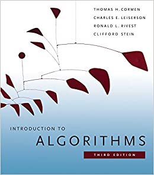| *Thomas Cormen* Introduction to Algorithms (3rd edition) | Развернутый академический курс по алгоритмам в одной книге. Нестареющая классика. В переводе известна как "Кормен. Алгоритмы. Построение и анализ"
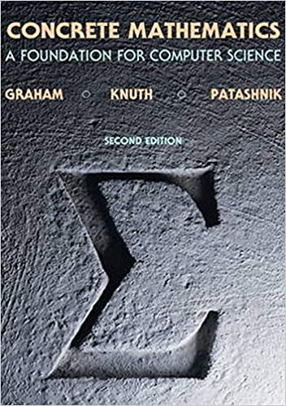|*Graham, Knuth, Patashnik* Concrete Mathematics | Алгоритмика, приближенная к математике.
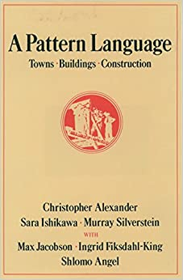| *Christopher Alexander* A Pattern Language | Вообще не программирование, а архитектура и урбанизм. Эта книга - первоисточник понятия "паттерн": не шаблон действий, а классификация решения класса проблем в схожих условиях, которая порождает общий язык у людей, занимающихся этими проблемами. Из архитектуры эта идея перекочевала в обсуждения на конференции OOPSLA, оттуда в научные статьи, и, наконец, в GoF
  